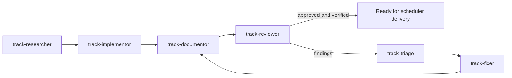

# Building several plans at once

`/orchestrate` takes a set of plans and works out which can be built at the
same time and which have to wait. Each group then gets its own git worktree and
its own session, which drives it through research, implementation,
documentation, a pull request, and a review loop with a hard ceiling.

It exists because the obvious way to parallelize agent work — several sessions
in one checkout — does not work. They overwrite each other, and nothing that
comes out is separately reviewable.

---

## The three ideas

### 1. A wave is about dependency; a track is about contention

These are different questions and conflating them is the mistake that costs
most, because it surfaces as a merge conflict hours later rather than as an
error up front.

**A wave** is a dependency layer. Plan B is in a later wave than A when B
cannot be *built or verified* until A's code exists. Waves are strictly
ordered: **wave N+1's worktrees are not created until the previous wave has
reached a terminal state and this track's prerequisites have merged.** A new
track starts from the synchronized base containing its dependencies; dependents
of stopped tracks stay parked while independent work can continue.

**A track** is a group of plans that would fight over the same files. They
share one worktree, one branch, one PR, and are built one after the other by
one implementor. Tracks within a wave run in parallel.

| Question | Answer |
|---|---|
| Would B's implementor need code only A produces? | different waves |
| Would B's tests fail until A lands? | different waves |
| Do A and B edit the same files, but neither needs the other? | same wave, same track |
| Neither? | same wave, different tracks |

```
base ──┬── w1t1 ──PR──┐
       └── w1t2 ──PR──┴──> base updated
                             ├── w2t1 ──PR──┐
                             └── w2t2 ──PR──┴──> base
```

The alternative — stacking wave 2 on wave 1's unmerged branch — buys wall-clock
time and costs reviewability: the second PR is unreadable until the first
lands, and any change during wave-1 review cascades a rebase down the stack.

### 2. Each track is a pipeline of agents that see different things

The seats are separated by **what they are allowed to know**, not just by task.
That is what makes the review meaningful.



The initial documentation pass precedes PR creation and review. Every repeat
review observes the configured round limit.


| Agent | Sees | Deliberately does not see |
|---|---|---|
| `track-researcher` | plan, specs, code | — |
| `track-implementor` | plan, research, specs, code | other tracks |
| `track-documentor` | everything on the branch | other tracks |
| `track-reviewer` | plan, specs, docs, diff | **research, implementor's reasoning, previous rounds** |
| `track-triage` | everything, including all rounds | — |
| `track-fixer` | plan, research, fix records | **the review discussion** |

The reviewer's isolation is the load-bearing part. An agent that reviews
against the same research the implementor worked from checks the
implementation against its own premise, which cannot catch a wrong premise.

That isolation needs enforcing, not just stating. The researcher commits its
brief **to the track branch**, so a plain `git diff <base>...HEAD` hands the
reviewer the very document it must not see. The reviewer is always given a
filtered diff:

```bash
git diff <base>...HEAD -- . ':(exclude).ai/research/' ':(exclude).ai/state/orchestration/'
```

The same filter hides the review log, which is where earlier rounds live.

And each review round gets a **fresh** reviewer with no memory of earlier
findings. If round 2 independently finds what round 1 found, that
re-discovery is the evidence a fix did not land. A reviewer handed the previous
round's list ticks it off instead of looking.

### 3. Commit every step slice

The implementor commits once per plan step, not once at the end — code, tests,
and the spec change that step makes true, together.

This is not tidiness. A reviewer arriving cold reads the branch commit by
commit; one 40-file commit is unreviewable and gets rubber-stamped. And when a
fixer goes back into the branch three rounds later, per-step history is what
lets it find where a behavior was introduced.

---

## Running one

It is two commands, and the split matters — see
[Why it is split in two](#why-it-is-split-in-two) below.

**1. Schedule.** In the main checkout:

```text
/orchestrate --all-backlog --dry-run       # just the schedule, nothing created
/orchestrate PLAN-011 PLAN-014 PLAN-018    # schedule and create wave-1 worktrees
```

**Start with `--dry-run`.** It returns a proposed manifest in the report
without writing files and stops. You get the
wave layout, the tracks, and — listed separately — every dependency the
orchestrator *inferred* rather than read from a plan. Those are the ones that
can be wrong, and checking them costs a minute against a run that costs hours.

Without `--dry-run`, the scheduler follows the approval boundary, reserves
IDs and creates only the current wave's worktrees. The detailed procedure is
[orchestrate](../.ai/commands/orchestrate.md).

**2. Build each track in its own session.** Manual dispatch is configured here.
Open a session rooted at the assigned absolute worktree and provide
[orchestrate-track](../.ai/commands/orchestrate-track.md), the run/track IDs,
base revision, ID ranges and granted actions. Return its terminal report to the
scheduler, then resume scheduling at the wave boundary.

A separately configured host can launch background sessions and provide
completion events. This repository contains no launcher, registration or
automatic wakeup mechanism. Do not claim an unattended run from the presence
of Markdown instructions or optional hooks.

The slash-style invocations below are procedure names, not shell commands.

Any time:

```text
/orchestrate-status            # where everything stands, checked against git
/orchestrate-clean --dry-run   # what cleanup would remove, and what it would lose
```

### Tracks never merge themselves

A track pushes, updates its PR, and exits `ready` or `stopped`. The **scheduler**
merges. Two reasons, and both are load-bearing:

- Tracks finish at unpredictable times. Two merging into the same base branch
  concurrently race each other; serialising it in one place removes that.
- A background track has nobody to answer a question. If `auto_merge: ask`
  prompted inside a track, it would hang forever. Asked by the scheduler
  instead, it is one question per wave, and nothing is blocked while other
  tracks are still running.

**One stuck track does not stall the run.** Whatever is `ready` merges; only
the plans that genuinely depend on a `stopped` track have to wait.

### Resuming

There is no resume command. `/orchestrate-track` works out its own stage from
git — which briefs exist, which plans have moved, what the branch contains,
what the review log says — and continues from there. Run it again and it picks
up.

## Why it is split in two

One session driving every track would hold all their state at once. Three
things follow from that, and all three go away when each track gets its own
session:

| Problem | Cause | What the split does |
|---|---|---|
| Confinement is only prose | Subagents inherit the caller's working directory — the main checkout | A session started in the worktree makes that the project root, so agents resolve paths there by default |
| Tracks wait at every stage | One session can only batch by stage, so all tracks pause for the slowest, eight times | Independent sessions have no shared scheduler to wait on |
| Nothing survives the session | Stage, round counts and PR numbers live in context | State is derived from git; the manifest is a static schedule |

The optional [hook examples](../.ai/hooks/README.md) illustrate advisory tier
notices and limited checks for writes outside a checkout. They are unregistered
and are not a sandbox. Actual session roots, permission controls and completion
signaling come from the host. The scheduler compares base status with its
preflight snapshot to detect unexpected changes without guessing who made them.

## Declaring dependencies

The orchestrator infers the graph when you do not declare it — from spec chains
(B amends a spec A creates), ADR references, `links:`, and file overlap. That
works, and it is still a guess.

Thirty seconds in the plan removes the guess:

```markdown
## Depends on

| Plan | Why this cannot start first |
|---|---|
| PLAN-011 | session storage does not exist until PLAN-011 lands |
```

Only for genuine build-order dependencies. Two plans touching the same files is
contention, not dependency — the orchestrator handles that by putting them in
one track.

## Settings

[Config](../.ai/config.yaml) owns the paths, concurrency limit, review ceiling,
blocking severity, forge, dispatch and merge posture. Consult its comments for
the available settings instead of maintaining a second default-value table.

Merge posture never grants authority. With `ask`, a scheduler requests a merge
decision only if the user has not already provided it; `auto` likewise needs
existing merge authority. Missing required verification or a required PR keeps
a track stopped regardless of the count of blocking findings.

## When a run stops

Three rounds of an agent failing to satisfy a reviewer means the problem is not
one more round. The track stops, posts a summary to the PR, and appears under
**Needs a human** in the manifest. Its worktree and branch stay in place so you
can pick up where it stopped. Other tracks carry on.

Other stopping points: the implementor hits a question only a human can answer
(`intent`-tier), a merge conflict between tracks that needs investigation,
or a dependency cycle found before starting.

A missing forge CLI, authentication or network can leave local building and
review available. A requested PR or hosted merge remains incomplete; preserve
the branch and report the delivery blocker instead of substituting a local merge.

## What a run leaves behind

- **Commits** on track branches, merged into base when delivery is authorized
- **`.ai/state/orchestration/ORCH-{nnn}.md`** — the manifest: why the waves
  were shaped that way, what each track did, every review round. Kept after the
  run closes; it is the first thing to read when a later run hits the same
  dependencies.
- **Research briefs** and a **review log** at
  `.ai/state/orchestration/<run>/<track>/`, merged with their track. The log is
  the durable round count: it lives on the track branch, so it has one writer,
  cannot conflict with another track, and survives a lost session.
- **Plans** in `.ai/plans/done/<period>/` after verification; Git and the forge
  separately establish merge, while records retain the reviewer's evidence
- **Fix records** in `.ai/fixes/done/`, each with the check that fails before it
  and passes after
- **Intake items** in `.ai/plans/intake/` for everything found and deliberately
  not fixed

## What it does not do

- **Resolve merge conflicts.** Tracks are separated by file contention so they
  should not conflict. If one does, that is an orchestrator mistake and the run
  stops rather than hiding it.
- **Replace `/plan-new`.** It builds plans; it does not write them. A vague
  plan is excluded from the run rather than built badly.
- **Replace `/plan-start`** for one plan. Use its bounded flow while
  honoring any worktree or PR requirement in the user's assignment.
- **Guarantee parallelism.** Eight plans that all touch the same module is one
  track wearing a costume, and the orchestrator will say so.
