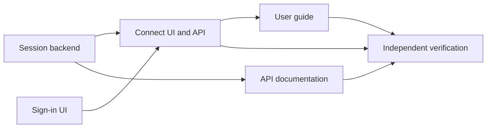

# Project and phase workflow

The workflow turns a project outcome into checked, documented implementation.
Project records live in `.planning/`; reusable instructions and tools live in
`.ai/`. The coordinator carries the request through the user's authorized
boundary, with fresh workers for bounded assignments.

| Reference | Owns |
|---|---|
| [RULES](../.ai/RULES.md) | Authority, work boundaries and completion policy |
| [Truth map](../.ai/truth-map.md) | Each fact's authoritative record |
| [Runtime guide](../.ai/runtime/README.md) | Actual commands, configuration and recovery |
| [Template contract](../.ai/runtime/TEMPLATE-CONTRACT.md) | Additional metadata connecting full templates to the Python runner |
| [Template guide](TEMPLATE-GUIDE.md) | Artifact selection, producers, consumers and lifecycle |
| [Feature guide](WORKFLOW-FEATURES.md) | Capability inventory, safeguards and limitations |
| [Proposed workflow direction](WORKFLOW-DIRECTION.md) | Next-stage feature, bug-fix and small-change entry paths; not newly implemented commands |

## 1. Onboard a new or existing project

| Step | New project | Existing project | Saved result |
|---|---|---|---|
| Establish intent | Confirm users, outcome, constraints and exclusions | Confirm purpose against the actual product | `.planning/PROJECT.md` |
| Inspect baseline | Inspect starter files, setup and available checks | Trace entry points, data flow, tests, configuration and relevant history | Findings; useful `.planning/codebase/` maps |
| Identify outcomes | Record needed capabilities | Record desired changes and confirmed gaps | `.planning/REQUIREMENTS.md` |
| Order phases | Group outcomes into coherent deliverables | Respect existing interfaces and real dependencies | `.planning/ROADMAP.md` |
| Configure execution | Set available worker routes and meaningful checks | Run the real commands and record the baseline | `.planning/config.yaml` and setup evidence |
| Establish current docs | Describe only implemented starter behavior | Reconcile current guides/specifications against source | Guides and `.planning/specs/` |
| Begin selected work | Detail the next useful phase | Create or reuse the relevant phase | `.planning/phases/NN-name/NN-CONTEXT.md` |

**Do:** preserve useful existing documentation, distinguish requirements from
observed behavior, and record actual authorization already supplied.

**Do not:** invent product identity, turn all historical notes into requirements,
assert that unrun checks pass, or repeat approval questions at internal steps when
the user already authorized the work.

For substantial discovery, use the complete library project and research
questioning guidance through the [support library](../.ai/library/README.md). The local
onboarding procedure remains [onboard](../.ai/commands/onboard.md). Optional
optional milestone and profile records are available when relevant; simply
importing their templates does not activate another scheduler.

## 2. Select the next phase

A phase groups outcomes that can be implemented and verified together. Keep its
directory stable throughout planning, execution and correction.

| Input | Decision it supports |
|---|---|
| PROJECT | Does this request fit the product purpose and boundaries? |
| REQUIREMENTS | Which desired outcomes does it satisfy? |
| ROADMAP | What prerequisites and sequence matter? |
| STATE plus observed runtime status | What is active, blocked, verified or awaiting delivery? |
| Current specifications and source | What exists, and what must remain compatible? |
| User request | Is this inspection, preparation, implementation or delivery authorization? |

Detail the next useful phase. Later phases can remain goals and dependency notes
until enough evidence exists to prepare them. A small defect still needs a clear
outcome and regression evidence; it does not need every optional artifact.

A returning session reads these existing records and resumes authorized work.
It does not repeat onboarding or restructure the repository because it has a new
context window. Read-only [phase status](../.ai/commands/phase-status.md) starts no
workers and changes no records.

## 3. Define, discuss and research

| Activity | Question answered | Artifact |
|---|---|---|
| Specify when useful | What does this phase deliver, and what proves it? | `NN-SPEC.md` from `spec.md` |
| Discuss | Which implementation choices are fixed, delegated or unresolved? | `NN-CONTEXT.md`; optional discussion log |
| Research | Which technical uncertainty could invalidate the approach? | `NN-RESEARCH.md`; relevant project research |
| Define validation | Which checks will expose plausible incorrect implementations? | `NN-VALIDATION.md` when useful |

The phase specification teaches falsifiable requirements, boundaries,
negative requirements and edge coverage. Phase CONTEXT retains exact acceptance,
actual decisions and execution authorization for the local runtime. Carry valid
requirements between them explicitly; a repeated heading must not become a second
contradictory source of intent.

Research compares source-backed options within the accepted product scope. It
can reveal a missing decision or technical incompatibility; it cannot grant new
scope. Keep consequential resolutions in CONTEXT. An unanswered question blocks
its dependent implementation while independent decided work can continue.

A desired phase specification and a current behavior specification differ:

| Record | Meaning |
|---|---|
| `.planning/phases/NN-name/NN-SPEC.md` | Required target for the phase, potentially not yet implemented |
| `.planning/specs/SPEC-NNN-capability.md` | Current evidenced contract, created from `CURRENT-SPEC.md` |
| `.planning/decisions/ADR-NNN-name.md` | Significant rationale and tradeoffs |

## 4. Prepare detailed plans and check them independently

Use the full [phase prompt template](../.ai/templates/phase-prompt.md) for
`NN-CC-PLAN.md`. Preserve its task actions, read-first inputs, verification,
completion conditions, negative guidance, examples and critical connections.
The [runtime contract](../.ai/runtime/TEMPLATE-CONTRACT.md) adds the metadata the
local runner needs. Do not substitute a short list of headings for the template.

| Plan element | Quality test |
|---|---|
| Objective and requirement mapping | Does completing this assignment advance an identified phase outcome? |
| Task actions | Can a fresh worker implement them without guessing the intended interface? |
| Files and ownership | Are all writes assigned, including tests and required docs? |
| Dependencies | Does each edge represent an actual input needed before work can begin? |
| Resources | Are shared ports, databases or external write targets declared? |
| Read-first/context | Are authoritative source, decisions and useful dependency summaries linked? |
| Verification and done | Would the checks catch a plausible wrong implementation? |
| Must-haves and key links | Does the plan cover connected behavior, not only separate files? |
| Documentation | Is each required document assigned to the worker able to verify it? |

For substantial work, a separate checker examines acceptance coverage,
feasibility, interfaces, ownership, task specificity and evidence quality. The
coordinator resolves findings within scope and repeats the affected review.
`phase.py check` adds structural validation; it does not replace this judgment.

The runtime automatically dispatches code, documentation and verification
workers. Researcher, preparer and preparation-checker contexts are arranged by
the coordinator. The complete library workflows describe those methods; they
are not all registered host commands in this repository.

The process runner accepts autonomous plans. Non-autonomous/checkpoint plans and
unresolved `user_setup` remain complete planning artifacts but block dispatch.
The coordinator handles the actual checkpoint, records the outcome and prepares
an autonomous continuation. Keep the checkpoint and its evidence; do not delete
it to make the readiness gate pass.

## 5. Execute with bounded fresh workers

| Role | Responsibility | Started by |
|---|---|---|
| Coordinator | Discuss, record decisions, assign ownership, schedule, integrate and deliver within authority | User's working session |
| Researcher | Resolve bounded questions and return evidence | Coordinator as useful |
| Phase preparer | Produce executable plans and validation approach | Coordinator |
| Phase checker | Independently inspect preparation without editing it | Coordinator |
| Coder | Implement one plan; check and commit changes and SUMMARY | Runtime after coordinator invokes execution |
| Documentor | Verify claims against integrated code; update assigned guides/specifications and SUMMARY | Runtime for documentation components |
| Verifier | Independently assess the integrated outcome at an exact revision | Runtime after coordinator invokes verification |

Each implementation worker receives its checkout, branch, assigned revision,
role, relevant core rules, phase context, one PLAN, required source, useful
research and integrated dependency summaries. It reads only the relevant skill
bodies in its own checkout. It need not inherit the full conversation.

Workers write only their assigned paths and result. They do not spawn more
workers, rewrite shared phase inputs, integrate branches or publish. Their
committed SUMMARY reports actual acceptance/documentation coverage, commands,
results, deviations and remaining issues.

## 6. Schedule dependencies, capacity and contention

| Component | Depends on | Responsibility |
|---|---|---|
| 03-01 Session backend | Agreed interface | Implement session behavior and backend checks |
| 03-02 Sign-in UI | Agreed interface | Build UI states against that interface |
| 03-03 Connect UI and API | 03-01, 03-02 | Wire behavior and check the full flow |
| 03-04 API documentation | 03-01 | Describe the implemented API and current contract |
| 03-05 User guide | 03-03 | Document the verified user flow |

This example illustrates scheduling; it does not establish authentication
requirements for an adopting project.

- Backend and UI may run together after their interface is settled.
- API documentation can begin when its own backend prerequisite is integrated
  and checked, even if unrelated work is still running.
- The connector waits for both actual prerequisite results.
- Overlapping owned files and declared exclusive resources serialize work.
- `execution.max_parallel` limits capacity; waves describe dependency shape and
  do not create a global barrier in the Python runtime.
- Worktrees isolate Git edits. They do not isolate a shared database, network
  account, service port or arbitrary external side effect.

A worker finishing successfully releases no dependent by itself. The coordinator
audits committed paths, ancestry, cleanliness and result coverage, integrates the
result and runs required checks before treating it as available.

## 7. Keep documentation attached to implementation

| Change | Documentation to inspect |
|---|---|
| Observable behavior | Current specification and user guide |
| Interface or command | API/CLI reference, callers and examples |
| Configuration or setup | Configuration and onboarding instructions |
| Operations or recovery | Operator guide and failure procedures |
| Significant architectural choice | ADR and affected contracts |
| Internal implementation only | Nearby explanation or a reason external docs do not change |

Assign each required document to the component that can complete it. A coder can
update nearby explanation; a later documentor depends on the implementation it
must inspect. Do not make the coder claim a guide that another worker has yet to
write.

Each obligation is **updated and verified**, **verified unchanged**, **not
applicable with a reason**, or **unresolved**. Missing required documentation
remains a completion gap. A document cannot redefine a valid requirement merely
to match a bug.

## 8. Verify the integrated outcome, accept and correct gaps

1. Run configured component and project checks at the integrated revision.
2. Start a fresh verifier with the phase's acceptance, source and documentation.
3. Trace actual behavior, producer/consumer wiring, error paths and negative
   guarantees. Existing files and convincing summaries are insufficient proof.
4. Audit and commit the independent report. A verifier that edits or commits its
   checkout invalidates its result.
5. Correct required gaps with bounded assignments; preserve earlier results as
   history and recheck affected behavior.
6. Complete required UAT using actual human observations. Pending, failed,
   blocked or skipped cases do not count as passes.

Verification names the source revision and content fingerprint. Material changes
to code, documents, plans or checks invalidate prior evidence. Generated status
and specified evidence records have controlled exclusions; consult the runtime
contract for the exact boundary. A successful exit code is not acceptance.

Use full template verification, validation, UAT, debugging and summary guidance
as appropriate. The Python runner's report fields and UAT mechanics remain
explicit in its runtime contract.

## 9. Make progress visible and finish delivery

| State | Meaning | What remains |
|---|---|---|
| Committed slice | Reviewable local change with a descriptive commit | Integration and required validation |
| Pushed draft PR | Authorized progress snapshot visible to the user | Remaining scope and final evidence |
| Verified final revision | Required local evidence covers current content | Required UAT/remote checks and delivery boundary |
| Ready PR | Final checks and required review have passed | Authorized merge if requested |
| Merged | Published revision observed merged through repository process | Authorized synchronization and safe cleanup |

When the user requests frequent pushes and a draft PR, the coordinator can push
committed progress slices through the forge workflow. Describe unfinished work
honestly. The runtime's `publish` remains a verified publication operation even
when `--draft` is supplied; that flag does not bypass readiness checks.

The runtime never merges. If merge is already authorized, the coordinator
reviews and fixes findings, verifies the final revision, observes required
checks, merges through the normal repository process, confirms the merge and
safely synchronizes the primary checkout. It does not ask again merely because
the workflow reached another internal step.

Cleanup removes only identified clean merged worktrees and branches within the
authorized scope. Verify absolute paths under the primary `.worktrees/` root.
Preserve dirty, unmerged, ignored, unrelated and uncertain data.

## 10. Recover an interrupted session

| Situation | Next action |
|---|---|
| Need a report only | Run read-only status; inspect source and current observations |
| Coordinator stopped | Inspect recorded supervisor/worker identities and checkouts before any restart |
| Worker output is clean and committed | Reconcile, audit and reuse it without replay when valid |
| Worker output is dirty, missing or blocked | Preserve it; inspect and prepare a bounded recovery |
| Integrated result failed checks | Recheck/correct integrated work; keep dependents waiting |
| Inputs changed | Commit approved changes and explicitly replan after reconciliation |
| Verifier report is incomplete or stale | Inspect stopped attempt and retry verification as documented |
| Old runtime checkpoint | Use its compatible original runtime; no silent conversion |

Local runtime attempts live under the Git common directory's `ai/phases/`, shared
by linked worktrees. Committed summaries, verification and UAT live with the phase
and travel with Git. A fresh clone has durable history but not the old machine's
process checkpoints. `status` is read-only; `sync` explicitly refreshes the
`Runtime Status` section of tracked `.planning/STATE.md`, preserving its authored
session memory and full template structure.

See the [runtime guide](../.ai/runtime/README.md) for exact resume, replan and
verification commands. Never interpret an old STATE entry as proof that a process
is still live.
