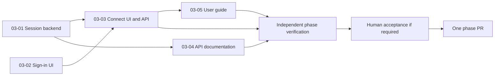

# Project and phase workflow

The workflow takes a project outcome through discussion, research, bounded
implementation, documentation and independent verification. A phase keeps the
decisions and evidence together. Independent components can run concurrently,
and one verified phase normally produces one pull request.

This guide explains how to use the pieces. [RULES](../.ai/RULES.md) owns shared
policy, the [truth map](../.ai/truth-map.md) identifies each fact's owner, and the
[runtime guide](../.ai/runtime/README.md) owns executable syntax and configuration.
Load detailed references when needed; this whole guide is not a required input
for every worker.

## Starting and onboarding a project

For a new product, start from this template and establish the actual product
intent before implementation. For an existing repository, inspect the real code
and preserve useful documentation while adopting the workflow in an assigned
worktree. This template's PROJECT stays unfilled until that adoption happens.

| Step | New project | Existing project | Saved result |
|---|---|---|---|
| Understand the purpose | Establish users, desired success, constraints and exclusions | Confirm that intent against what the project already does | PROJECT |
| Establish the baseline | Inspect the available starter code and setup | Inspect source, entry points, configuration, tests and recent history; run the checks | Actual findings; optional codebase maps |
| Define outcomes | Identify what the product needs to achieve | Identify missing capabilities, confirmed defects and desired changes | REQUIREMENTS |
| Order the work | Group related outcomes into coherent phases | Order changes around real dependencies and existing capabilities | ROADMAP |
| Prepare execution | Configure available worker commands and meaningful local and PR checks | Verify those commands against the existing project and record the baseline | config.yaml and setup evidence |
| Establish current documentation | Document only behavior that exists | Compare relevant guides and SPECs with code; resolve discrepancies with evidence | Current guides and SPECs |
| Start the next phase | Record the first useful outcome | Create or reuse the phase covering the selected change | CONTEXT with scope, acceptance, decisions and actual authorization |

The coordinator records what the user has already decided. Missing consequential
decisions block their dependent work, while independent investigation can
continue. A request to inspect or define direction does not authorize
implementation. A request that already authorizes implementation does not need
to be reconfirmed at every internal step.

For a large project, PROJECT explains the purpose, REQUIREMENTS identifies
desired outcomes, and ROADMAP orders coherent phase goals and dependencies.
For example, a product might need foundation, storage, authentication and
reporting phases. Detail the next useful phase; later phases can remain goals
and dependency notes until there is enough evidence to prepare them. This does
not introduce milestones, INTAKE records, standalone PLAN records or a separate
work-item hierarchy.

A returning session reads PROJECT, STATE, ROADMAP and the selected phase's
context and evidence, then inspects current status and source. It resumes
authorized work instead of repeating adoption or restructuring the repository.
See [onboard](../.ai/commands/onboard.md) and
[starting requests](ONBOARDING-PROMPTS.md).

## Agents and who starts them

Roles describe responsibilities and write boundaries. They do not install
agents or grant process permissions.

| Role | Purpose and output | Who starts or assigns it |
|---|---|---|
| [Coordinator](../.ai/agents/coordinator.md) | Leads discussion, records decisions, assigns ownership, schedules, integrates, tracks and publishes within authority | The user's working session takes this role |
| [Researcher](../.ai/agents/researcher.md) | Answers bounded questions using source evidence; writes assigned RESEARCH or maps | Coordinator arranges it when investigation is useful |
| [Phase preparer](../.ai/agents/phase-preparer.md) | Splits the outcome into executable components and a validation approach | Coordinator arranges it for substantial decomposition |
| [Phase checker](../.ai/agents/phase-checker.md) | Independently checks coverage, feasibility, interfaces and dependencies; returns findings without edits | Coordinator obtains it before substantial implementation |
| [Coder](../.ai/agents/coder.md) | Implements one assigned component, checks it, commits changes and SUMMARY | Coordinator invokes runtime execution; runtime starts a fresh worker when ready |
| [Documentor](../.ai/agents/documentor.md) | Checks implementation evidence and updates assigned guides or SPECs; commits documentation and SUMMARY | Runtime starts a fresh documentation worker for its prepared component |
| [Verifier](../.ai/agents/verifier.md) | Assesses the integrated outcome, wiring, regressions and documentation at a specific revision | Coordinator invokes runtime verification; runtime starts a separate reviewer |

Discussion, research and preparation are coordinator-led procedures. The
runtime automatically dispatches coders, documentors and the verifier; invoking
execution does not automatically create researchers or preparers. Small phases
do not need every role.

Implementation workers do not start more agents, edit shared phase inputs or
status, integrate branches, or publish. A verifier keeps its checkout unchanged
and returns an external report; the coordinator audits and commits the report.
These boundaries keep several workers from independently changing the plan or
claiming completion.

## How a phase progresses

| Stage | What happens | Files created or updated |
|---|---|---|
| Receive and discuss | Reuse a relevant phase or allocate a stable directory; establish scope, acceptance, decisions, questions and authorization | CONTEXT and roadmap link; DISCUSSION-LOG only if useful |
| Research | Investigate unanswered technical questions and save reusable evidence | Optional RESEARCH or codebase maps |
| Prepare | Agree shared interfaces and split acceptance into bounded code and documentation components | IMPLEMENT files; optional shared VALIDATION |
| Check readiness | Independently assess substantial preparation, resolve blockers, commit inputs and run the structural check | Preparation findings and resolutions in CONTEXT |
| Execute | Start fresh workers as their prerequisites, capacity and resources become available | Component changes and SUMMARY |
| Integrate | Audit actual committed output, integrate successful results into the phase branch and run checks | Integrated commits and runtime evidence |
| Verify and correct | Independently inspect the whole outcome; add bounded corrections for gaps and verify again | VERIFICATION; corrective instructions/results if needed |
| Accept and publish | Record real human observations when required, publish the phase PR and observe its checks | UAT when applicable and PR/check evidence |

A phase folder keeps its path throughout the process. Status comes from
instructions, committed results and observed evidence; moving folders or checking
a box does not establish completion. Publishing and merging are separate events.

### What each implementation worker receives

| Input | Why it is included |
|---|---|
| Assigned checkout, branch, source revision and result path | Establish exactly where to work and return evidence |
| Role and applicable core rules | Establish responsibilities and constraints |
| Relevant phase CONTEXT | Preserve the agreed scope, acceptance and decisions |
| One IMPLEMENT document | Give the objective, exact owned files or directory prefixes, resources, dependencies, checks and documentation obligations |
| Read-first source and relevant findings | Supply enough context to act without rediscovering the entire project |
| Integrated prerequisite code and dependency summaries | Explain what earlier components provide and how it was checked |

Workers get a focused assignment and read the relevant files. They do not need
the complete discussion history or every other component's instructions.
The [handoff reference](../.ai/references/worker-handoff.md) defines assignment
and result destinations.

A component worker commits actual changes and its SUMMARY. The runtime audits
the paths changed in every commit, ancestry, cleanliness and result coverage,
then runs required checks. A successful process exit or a convincing summary
does not by itself prove successful implementation.

Ownership uses the exact path spelling Git records, including case and
whitespace. Conservative scheduling of case variants does not authorize a
worker to commit a differently spelled path.

## How waves flow: authentication example

These component names illustrate decomposition, not preapproved authentication
requirements. Establish the real session, access and interface decisions in
CONTEXT before preparing implementation.

| Component | Depends on | Bounded responsibility |
|---|---|---|
| 03-01 Session backend | Existing identity capability and agreed interface | Implement session and access behavior with backend checks |
| 03-02 Sign-in UI | Agreed interface | Build the UI states against that interface with local checks |
| 03-03 Connect UI and API | 03-01 and 03-02 | Wire the components together and check end-to-end behavior |
| 03-04 API documentation | 03-01 | Document the implemented backend interface and relevant SPEC |
| 03-05 User guide | 03-03 | Document the integrated sign-in flow and relevant SPEC |



The backend and UI can start together if their interfaces are settled and their
owned paths and resources are independent. As soon as the backend is integrated
and checked, API documentation can start even if the UI is still running.
Connecting UI and API waits for both implementation prerequisites. The user guide
waits for the integrated flow. Independent verification assesses the completed
phase, including all required documentation.

A wave describes dependency groups; it is not a global barrier. Each component
waits for its own integrated and checked prerequisites. Shared files or exclusive
resources serialize otherwise independent components. If both documentation
assignments need the same SPEC file, assign clear ownership and serialize that
overlap; do not rely on the diagram alone to prevent conflicts.

[Config](../.ai/config.yaml) controls concurrency; the current template default
is three component workers, with supported capacity from one to eight. One
coordinator operates per repository at a time. Workers use sibling worktrees;
Git integration remains serialized. Separate worktrees do not isolate a shared
database, service or port, so those resources must be declared.

Within a phase, a dependency means integrated, checked component output on the
phase branch. Between phases, a dependency requires the prerequisite's verified
code and report on the fetched publication base. Another worker's branch or an
open prerequisite PR is not delivered prerequisite behavior.

## When documentation is written

Documentation starts with intent and decisions, continues with implementation
evidence, and finishes with checked current guidance. It is not a separate
cleanup project after the feature has shipped.

| Owner | What belongs there | When it changes |
|---|---|---|
| PROJECT | Purpose, users, success and boundaries | On adoption or an actual change in intent |
| REQUIREMENTS | Desired outcomes and phase mapping | When outcomes are agreed or revised |
| ROADMAP | Phase goals, order, dependencies and links | When phases are added or reordered |
| CONTEXT | Exact phase scope, acceptance, decisions and authorization | During discussion and when an actual resolution changes scope |
| RESEARCH / VALIDATION | Reusable findings / shared checking strategy | When investigation or common test setup is needed |
| IMPLEMENT | Bounded instructions, ownership, prerequisites and obligations | Before execution; preserve completed instructions when correcting later |
| SUMMARY | What a component changed, checked, deviated from or could not finish | At the worker's completed or blocked handoff |
| specs/ | Current verified behavior | In the same deliverable change as the behavior it describes |
| docs/ | Actual setup, usage and operating guidance | With the implementation or a verified documentation correction |
| decisions/ | Significant architectural rationale | When a significant decision is accepted or superseded |
| VERIFICATION / UAT | Independent evidence / actual human observations | On review, acceptance and renewed checks after relevant changes |
| STATE | Compact derived progress and next action | When the coordinator explicitly runs sync |

Coders can update assigned comments and nearby explanations while the code is
fresh in their context. Substantial guides and SPECs go to a documentor component
with dependencies on the code it describes. Documentation obligations are listed
on the component responsible for completing them. A guide that will be written
later belongs to that documentation component, with a handoff reference in the
coder's instructions.

Each obligation ends **updated and verified**, **verified unchanged**, **not
applicable with a reason**, or **unresolved**. Required unresolved coverage
prevents completion. A not-applicable label cannot remove a valid required
document or excuse missing behavior. The verifier checks claims against actual
code, callers and checks, including documented commands where appropriate.
See [documentation coverage](../.ai/references/documentation.md).

Future promises stay in phase context until implemented; current SPECs remain
truthful on the deliverable revision. Git and phase records retain ordinary
history. Significant ADRs preserve rationale and are superseded with links when
needed. There is no mandatory separate amendment or journal for routine changes.

### When statements conflict

| Evidence shows | Required response |
|---|---|
| Code violates valid required behavior | Repair the code and prove the correction |
| A document misstates established correct behavior | Correct the stale wording using implementation evidence |
| Approved future behavior differs from current code | Carry out the authorized transition; update current docs when it is true |
| Human decisions conflict | Record the actual resolution in CONTEXT before dependent work |
| Several documents claim ownership of the same fact | Keep one owner and link to it from the others |

Tests and research supply evidence; they cannot silently redefine user intent.
Never weaken acceptance or rewrite a valid requirement to excuse a bug.
Unrelated findings stay in the phase's Deferred section, with evidence and scope,
or become a separately authorized phase. Required gaps cannot be deferred away
to make the current phase appear complete. Follow the
[conflict rules](../.ai/RULES.md#documents-and-conflicts).

## Smaller and larger requests use the same structure

| Request | Simplest useful route |
|---|---|
| Known small bug | CONTEXT, one IMPLEMENT/SUMMARY pair, reproduction, repair, regression proof and independent VERIFICATION |
| Unknown failure | Bounded research, then prepare a repair or resolve the decision revealed by the evidence |
| Documentation correction | One documentation component; inspect the claim, update it and verify the result |
| Research-only request | Supported findings and explicit remaining questions; no claim of implemented or delivered code |
| Multi-component feature | Prepare interfaces, ownership and dependencies; run ready components, integrate, document and verify the whole outcome |
| Large project direction | Define PROJECT and REQUIREMENTS, order phases in ROADMAP, then detail the next useful phase |

Small changes may omit research, a discussion log and a lengthy validation
document. They still preserve the requested outcome and meaningful evidence.

## Commands and skills

The [command catalog](../.ai/commands/README.md) contains procedures an assistant
can follow by name or from an ordinary-language request. These Markdown files
are not installed slash commands. Role files and references supply instructions;
this architecture requires no separate skills directory or skill registry.
Optional host skills can help a particular assignment without becoming another
tracking layer.

| Procedure | Purpose | Executable boundary |
|---|---|---|
| onboard | Establish or refresh real project context | Inspection and authorized setup |
| worktree | Assign the correct isolated checkout | Git worktree operations |
| phase-new | Receive a request into a phase | new |
| phase-discuss | Resolve scope, acceptance and decisions | Coordinator edits |
| phase-research | Investigate bounded questions | Coordinator-arranged research |
| phase-prepare | Define components and obtain readiness assessment | check for structural validation |
| phase-start | Implement and integrate ready components | run |
| phase-status | Inspect progress and next action | status; add --remote to observe PR checks |
| phase-resume | Reconcile interrupted execution | resume after inspecting stopped workers |
| phase-verify | Independently assess the integrated revision | verify |
| phase-uat | Preserve human acceptance observations | uat |
| phase-ship | Push and create/update the verified PR | publish |

The executable interface is `python .ai/runtime/phase.py`. Its separate `sync`
operation commits an updated STATE view; status itself is read-only. Install
dependencies, configure actual worker routes and checks, and use the
[runtime command reference](../.ai/runtime/README.md#commands) for full syntax.
Separate commands do not require separate permission requests for steps already
authorized.

## Folder and file structure

This shows the installed workflow and illustrative adopting-project artifacts.
The authentication phase, product source and named SPECs/ADRs are examples, not
files seeded as real work in this unadopted template. Create optional artifacts
only when they add useful information.

```text
project/
  AGENTS.md                          Agent entry point and required reading
  README.md                          Project introduction and navigation
  src/                               Illustrative product source; keep the real layout
  tests/                             Project checks; template includes runtime tests
  docs/
    PHASE-WORKFLOW.md                 This end-to-end workflow guide
    ONBOARDING-PROMPTS.md             Reusable starting requests
    PHASE-MIGRATION.md                Requested template migration reference/history
    ...                              Adopting project's setup, usage and operations guides
  .ai/
    README.md                        Workflow navigation
    PROJECT.md                       Purpose, success and boundaries
    REQUIREMENTS.md                  Desired outcomes and phase mapping
    ROADMAP.md                       Phase goals, order, dependencies and links
    STATE.md                         Compact derived progress and next action
    RULES.md                         Shared authority, scope and evidence rules
    config.yaml                      Worker routes, concurrency and real checks
    truth-map.md                     Index of each fact's single owner
    codebase/
      README.md                      When to create reusable maps of existing code
      ...                            Optional inspected architecture/source maps
    phases/
      README.md                      Phase directory conventions
      03-authentication/             Example stable phase directory
        03-CONTEXT.md                Scope, acceptance, decisions and authorization
        03-DISCUSSION-LOG.md         Optional discussion history
        03-RESEARCH.md               Optional findings and source evidence
        03-VALIDATION.md             Optional shared checking strategy
        03-01-IMPLEMENT.md           Backend component instructions
        03-01-SUMMARY.md             Backend result and actual checks
        03-02-IMPLEMENT.md           UI component instructions
        03-02-SUMMARY.md             UI result and actual checks
        03-03-IMPLEMENT.md           Wiring component instructions
        03-03-SUMMARY.md             Integrated-flow result
        03-04-IMPLEMENT.md           API documentation instructions
        03-04-SUMMARY.md             API documentation coverage
        03-05-IMPLEMENT.md           User guide instructions
        03-05-SUMMARY.md             User guide coverage
        03-VERIFICATION.md           Independent integrated phase assessment
        03-UAT.md                    Human acceptance session when applicable
        .continue-here.md            Optional pause/continuation guidance
    specs/
      SPEC-*.md                      Current verified behavior; created when needed
    decisions/
      ADR-*.md                       Significant rationale; created when needed
    agents/
      README.md                      Role catalog
      coordinator.md                 Decisions, scheduling, integration and delivery
      researcher.md                  Bounded investigations with evidence
      phase-preparer.md              Component instructions and validation approach
      phase-checker.md               Independent preparation assessment
      coder.md                       Scoped implementation and checks
      documentor.md                  Scoped current documentation
      verifier.md                    Independent outcome assessment
    commands/
      README.md                      Procedure catalog
      onboard.md                     Project adoption and returning sessions
      worktree.md                    Checkout assignment and delivery lifecycle
      phase-new.md                   Create/reuse phase scope
      phase-discuss.md               Resolve decisions and acceptance
      phase-research.md              Investigate unknowns
      phase-prepare.md               Prepare and check components
      phase-start.md                 Execute ready components
      phase-status.md                Observe evidence and next action
      phase-resume.md                Reconcile an interruption
      phase-verify.md                Verify integrated behavior
      phase-uat.md                   Record human acceptance
      phase-ship.md                  Publish the phase PR
    references/
      phase-artifacts.md             Artifact purposes and metadata
      worker-handoff.md              Assignment and result contract
      documentation.md               Documentation ownership and coverage
    templates/
      README.md                      Template usage
      PROJECT.md                     Project intent starting shape
      CONTEXT.md                     Phase scope and decisions
      DISCUSSION-LOG.md              Optional discussion record
      RESEARCH.md                    Reusable findings
      VALIDATION.md                  Shared checking strategy
      IMPLEMENT.md                   Bounded component instructions
      SUMMARY.md                     Committed component result
      VERIFICATION.md                Independent assessment
      UAT.md                         Persistent human observations
      CONTINUE.md                    Pause note starting shape
      SPEC.md                        Current behavior starting shape
      ADR.md                         Significant decision starting shape
    runtime/
      README.md                      Installation, commands and operational limits
      requirements.txt               Runtime dependencies
      phase.py                       CLI entry point
      phase_records.py               Markdown/config parsing and input validation
      phase_runner.py                Scheduling, integration, status and recovery
      phase_process.py               Worker supervision and process identity
    hooks/                           Optional advisory notices and their Bash tests
    fixes/                           Preserved historical repairs; no active queue
  .github/
    workflows/
      validate.yml                   Windows/Linux workflow and hook checks
  .worktrees/                        Ignored local checkout root
    phase-authentication/            Illustrative coordinator integration checkout
    phase-03-01-<id>/                 Component sibling checkout with unique suffix
    phase-03-verify-<id>/             Verifier sibling checkout with unique suffix
```

Numbered IMPLEMENT/SUMMARY pairs belong to their phase and have no independent
lifecycle. The [artifact reference](../.ai/references/phase-artifacts.md) defines
which files are required at each stage. Human-authored records use Markdown with
small YAML frontmatter and configuration in config.yaml; there are no JSON schema
files to author or maintain.

Runtime prompts, logs, locks and machine-maintained YAML checkpoints live under
`ai/phases/` in the Git common directory, outside the tracked project documents.
In a normal primary checkout that is `.git/ai/phases/`. These track local
processes and integration; they are not another human-maintained record system.

## Tracking, interruption and correction

| Situation | What happens |
|---|---|
| A worker is running | Local checkpoints track its assignment, revision, worktree and process identities |
| A worker returns | Its commits and SUMMARY are audited before integration and dependency release |
| A check fails | Evidence stays visible; affected dependents do not start |
| Execution is interrupted | Inspect processes, worktrees, commits and summaries before resume; preserve incomplete work |
| A stopped worker has valid committed output | Audit and reuse it without starting the same implementation again |
| A verifier was interrupted | Reuse a valid current report or explicitly reconcile and retry verification |
| Scope or implementation needs correction | Record actual decisions, preserve completed instructions, append corrective components and explicitly replan |
| Code, docs, inputs or checks change | Prior verification becomes stale; obtain current evidence again |
| A clean phase branch gains a commit after its PR was merged | The older merge observation cannot mark the newer branch revision delivered |
| A user asks for progress | status reports observed evidence; sync separately refreshes STATE |

The supervisor records process identity before worker launch, and recovery checks
both supervisor and worker identities. Live or ambiguous writers require
inspection; a missing checkpoint is not a reason to blindly restart. Use
[phase-resume](../.ai/commands/phase-resume.md) and the
[runtime recovery reference](../.ai/runtime/README.md#integration-failures-and-recovery).

Committed summaries and verification/UAT records travel with the repository.
Local process checkpoints do not travel to a fresh clone. A pause note helps a
returning coordinator, but cannot override actual Git or process evidence.
Never clear failed evidence or weaken acceptance just to restart execution.

## Publication, merge and cleanup

[Phase-ship](../.ai/commands/phase-ship.md) publishes one phase PR by default.
Publication requires actual authorization, current independent verification,
passing configured local checks and required human acceptance. UAT records real
observations: pending, failed, blocked or skipped required cases prevent
publication.

Creating or updating the PR can start CI. Inspect current remote checks before
declaring readiness; publication does not wait for them to finish. Review and
fix actionable findings, then rerun affected checks. A published PR, verified
source and a merged result are separate facts.

The runtime never merges. When the user authorizes merge and cleanup, the
coordinator separately verifies the final PR checks and review state, merges
through the repository's normal process, observes the merge, fast-forwards the
primary checkout, and removes only the identified clean merged worktrees and
branches within that authorization. Preserve incomplete, dirty, unrelated or
unidentified ignored data. If the user asks to leave the PR open, retain the
worktree for review. Follow the [worktree procedure](../.ai/commands/worktree.md).

## Why this improves consistency and execution

| Mechanism | Intended benefit |
|---|---|
| One phase directory and one owner per fact | Fewer duplicate contracts and less status drift |
| Focused assignments, source links and dependency summaries | Less repeated context and lower token use |
| Explicit interfaces, ownership and resources | Fewer conflicting edits and missing handoffs |
| Dependency-driven scheduling | Ready components proceed while unrelated work continues |
| Durable committed results and inspected recovery | Less repeated work after interruption |
| Documentation obligations in the same phase and PR | Guidance stays attached to the implementation |
| Required checks and independent integrated verification | Missing behavior, wiring and documentation remain visible |

These mechanisms reduce avoidable work; they cannot guarantee model correctness
or useful checks. Adopting projects still supply meaningful acceptance, real
worker routes, appropriate host permissions and evidence for their actual
product behavior.
